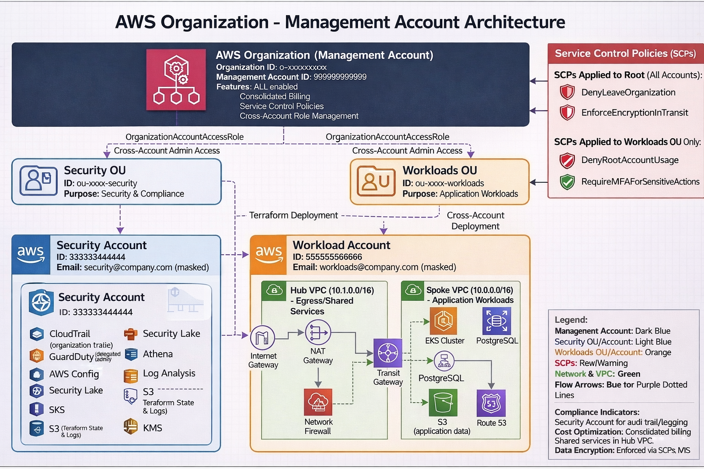

# AWS Management Account - Terraform Infrastructure

This directory contains the Terraform configuration for the AWS Management Account, which serves as the root account for the AWS Organization. The management account is responsible for creating and managing member accounts, organizational units (OUs), and organization-wide policies.

## 🏗️ Architecture Overview

The management account establishes a multi-account AWS environment with the following structure:



```
AWS Organization (Root)
├── Management Account (This account)
├── Security OU
│   └── Security Account (Centralized logging, monitoring, compliance)
└── Workloads OU
    └── Workload Account (EKS clusters, applications)
```

## 📋 Components

### Core Organization Resources

- **AWS Organization**: Root organization with all features enabled
- **Organizational Units (OUs)**: Logical groupings for accounts
- **Member Accounts**: Security and workload accounts
- **Service Control Policies (SCPs)**: Organization-wide governance policies

### Security & Compliance

- **Service Control Policies**: Preventive guardrails for security
- **AWS Service Access**: Enabled for security and compliance services
- **Cross-Account Roles**: OrganizationAccountAccessRole for management access

### Enabled AWS Services

- CloudTrail (Organization-wide audit logging)
- Config (Multi-account compliance monitoring)
- GuardDuty (Threat detection)
- Security Hub (Security findings aggregation)
- Security Lake (Security data lake)
- Access Analyzer (IAM analysis)
- Detective (Security investigation)
- Inspector (Vulnerability management)
- Macie (Sensitive data discovery)
- AWS SSO/Identity Center
- AWS Backup (Centralized backup policies)
- Compute Optimizer (Resource optimization)
- License Manager (Software license tracking)
- Service Catalog (Approved product catalog)
- RAM (Resource Access Manager)
- Firewall Manager (Network security)
- AWS Health (Service health events)

## 🚀 Quick Start

### Prerequisites

- AWS CLI configured with management account credentials
- Terraform >= 1.5.0
- Valid email addresses for member accounts (must be unique)

### 1. Configure Variables

Create or update `terraform.tfvars`:

```hcl
# Required: Unique email addresses for member accounts
security_account_email = "security@yourcompany.com"
workload_account_email = "workloads@yourcompany.com"

# Optional: Additional tags
tags = {
  Organization = "YourCompany"
  Environment  = "Production"
  CostCenter   = "IT"
}
```

### 2. Initialize and Deploy

```bash
# Initialize Terraform
terraform init

# Review the plan
terraform plan

# Deploy the organization
terraform apply
```

### 3. Verify Deployment

```bash
# Test cross-account access
./test-admin-access.sh

# View organization structure
aws organizations list-accounts
aws organizations list-organizational-units --parent-id $(terraform output -raw organization_root_id)
```

## 🔐 Service Control Policies (SCPs)

The management account implements several production-grade SCPs for security and compliance:

### 1. Deny Leave Organization

- **Purpose**: Prevents accounts from leaving the organization
- **Scope**: All accounts (root level)
- **Impact**: Blocks `organizations:LeaveOrganization`

### 2. Deny Root Account Usage

- **Purpose**: Prevents root account usage with necessary exceptions
- **Scope**: Workloads OU
- **Exceptions**: Billing, account recovery, support, MFA management
- **Impact**: Blocks all root account actions except critical operations

### 3. Require MFA for Sensitive Actions

- **Purpose**: Enforces MFA for IAM modifications
- **Scope**: Workloads OU
- **Impact**: Requires MFA for user/role/policy changes

### 4. Enforce Encryption in Transit

- **Purpose**: Ensures all traffic is encrypted
- **Scope**: All accounts (root level)
- **Impact**: Blocks unencrypted S3 and ELB traffic

## 🔄 Cross-Account Access

The management account can access member accounts using the `OrganizationAccountAccessRole`:

### AWS Console Access

1. Sign in to AWS Console with management account
2. Use "Switch Role" feature
3. Enter member account ID and role name: `OrganizationAccountAccessRole`

### AWS CLI Access

```bash
# Assume role in workload account
aws sts assume-role \
  --role-arn "arn:aws:iam::WORKLOAD-ACCOUNT-ID:role/OrganizationAccountAccessRole" \
  --role-session-name "management-access"

# Use returned credentials or configure profile
aws configure set aws_access_key_id "ACCESS_KEY_FROM_ABOVE"
aws configure set aws_secret_access_key "SECRET_KEY_FROM_ABOVE"
aws configure set aws_session_token "SESSION_TOKEN_FROM_ABOVE"
```

### Terraform Cross-Account Access

```hcl
provider "aws" {
  alias  = "workload"
  region = "us-east-1"

  assume_role {
    role_arn = "arn:aws:iam::${var.workload_account_id}:role/OrganizationAccountAccessRole"
  }
}
```

## 📊 Outputs

The configuration provides comprehensive outputs for integration with other Terraform configurations:

### Organization Information

- `organization_id`: AWS Organization ID
- `organization_arn`: Organization ARN
- `organization_root_id`: Root OU ID
- `management_account_id`: Management account ID

### Member Account Information

- `security_account_id`: Security account ID
- `workload_account_id`: Workload account ID
- Account ARNs and email addresses (sensitive)

### Cross-Account Role ARNs

- `security_account_access_role_arn`: Role ARN for security account access
- `workload_account_access_role_arn`: Role ARN for workload account access

### Policy IDs

- SCP policy IDs for reference in other configurations

## 🛠️ Manual Setup Required

Some AWS services require manual configuration after Terraform deployment:

### AWS Backup Organization Setup

```bash
# Enable in AWS Console: AWS Backup → Settings → Organization
# Or use CLI:
aws backup put-backup-vault-access-policy --backup-vault-name default --policy '{...}'
```

### Compute Optimizer Enrollment

```bash
aws compute-optimizer update-enrollment-status --status Active --include-member-accounts
```

### License Manager Service Role

```bash
aws iam create-service-linked-role --aws-service-name license-manager.amazonaws.com
```

## 🧪 Testing

### Automated Testing

Run the included test script to verify cross-account access:

```bash
./test-admin-access.sh
```

This script tests:

- OrganizationAccountAccessRole existence
- Cross-account role assumption
- Admin permissions in member accounts
- VPC, IAM, and S3 access

### Manual Verification

```bash
# List organization accounts
aws organizations list-accounts

# List organizational units
aws organizations list-organizational-units --parent-id $(terraform output -raw organization_root_id)

# List attached policies
aws organizations list-policies-for-target --target-id $(terraform output -raw workloads_ou_id) --filter SERVICE_CONTROL_POLICY

# Test SCP effectiveness (should be denied)
aws organizations leave-organization  # Should fail with SCP denial
```

## 🔧 Troubleshooting

### Common Issues

#### 1. Email Address Already in Use

```
Error: email address already associated with an account
```

**Solution**: Use unique email addresses or email aliases (e.g., `user+security@domain.com`)

#### 2. Cannot Assume Cross-Account Role

```
Error: User is not authorized to perform: sts:AssumeRole
```

**Solutions**:

- Verify you're using management account credentials
- Check the role name is exactly `OrganizationAccountAccessRole`
- Ensure the member account was created successfully

#### 3. SCP Blocking Legitimate Actions

```
Error: User is not authorized due to an explicit deny in a service control policy
```

**Solutions**:

- Review SCP policies in `org-account.tf`
- Temporarily detach SCP for testing
- Add exceptions to SCP if needed

#### 4. Terraform State Issues

```
Error: Resource already exists
```

**Solutions**:

- Import existing resources: `terraform import aws_organizations_organization.org o-xxxxxxxxxx`
- Use `terraform state` commands to manage state
- Consider using `terraform import` for existing accounts

### Debugging Commands

```bash
# Check organization status
aws organizations describe-organization

# List all accounts
aws organizations list-accounts --output table

# Check SCP attachments
aws organizations list-targets-for-policy --policy-id $(terraform output -raw scp_deny_root_usage_id)

# Test role assumption
aws sts get-caller-identity
aws sts assume-role --role-arn "arn:aws:iam::ACCOUNT-ID:role/OrganizationAccountAccessRole" --role-session-name test
```

## 📚 Best Practices

### Security

- ✅ Use unique email addresses for each account
- ✅ Enable MFA on management account root user
- ✅ Regularly review and audit SCP policies
- ✅ Monitor CloudTrail logs for root account usage
- ✅ Use least-privilege access principles

### Operations

- ✅ Tag all resources consistently
- ✅ Use descriptive names for accounts and OUs
- ✅ Document any manual configuration steps
- ✅ Test cross-account access regularly
- ✅ Keep Terraform state secure and backed up

### Cost Management

- ✅ Set up billing alerts for each account
- ✅ Use Cost Explorer for multi-account analysis
- ✅ Implement cost allocation tags
- ✅ Regular cost optimization reviews

## 🔗 Related Documentation

- [Security Account README](../security-account/README.md)
- [Workload Account README](../workload-account/README.md)
- [AWS Organizations Best Practices](https://docs.aws.amazon.com/organizations/latest/userguide/orgs_best-practices.html)
- [Service Control Policies Guide](https://docs.aws.amazon.com/organizations/latest/userguide/orgs_manage_policies_scps.html)

## 📞 Support

For issues with this configuration:

1. Check the troubleshooting section above
2. Review AWS Organizations documentation
3. Verify your AWS CLI configuration and permissions
4. Test with the included `test-admin-access.sh` script

---

**⚠️ Important**: This is the management account configuration. Changes here affect the entire organization. Always test changes in a non-production environment first.
