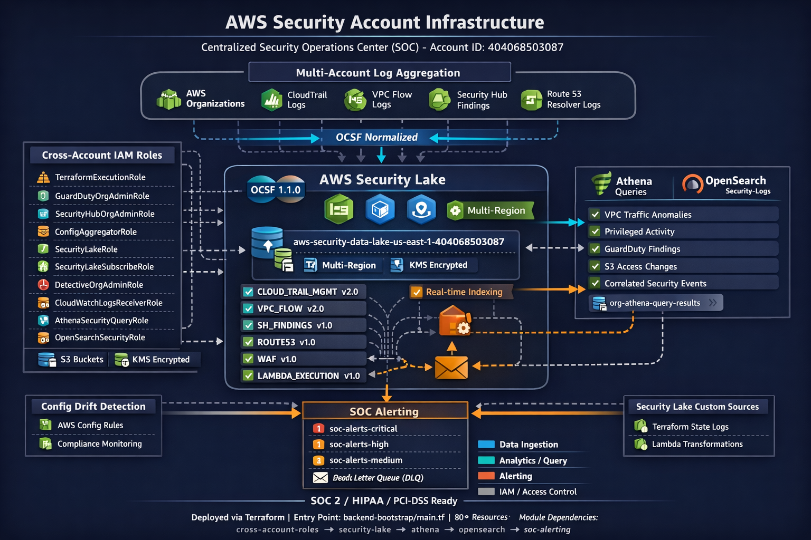

# 🛡️ Security Account - Complete Documentation

## 🏗️ Security Account Architecture



_Complete security account architecture showing AWS Security Lake integration, cross-account roles, OpenSearch monitoring, Athena analytics, and SOC alerting infrastructure with OCSF 1.1.0 standardized data flows._

---

## 🚀 Quick Start (New Users Start Here!)

**Single Command Deployment:**

```bash
cd security-account/backend-bootstrap && terraform apply
```

📖 **See:** [QUICK-REFERENCE.md](./QUICK-REFERENCE.md) - One-page deployment guide
📖 **See:** [UNIFIED-DEPLOYMENT-GUIDE.md](./UNIFIED-DEPLOYMENT-GUIDE.md) - Complete deployment documentation

---

## 📋 What's Deployed

All security infrastructure is deployed from `backend-bootstrap/main.tf` in a single operation:

| Component               | Purpose                                         | Auto-Deployed |
| ----------------------- | ----------------------------------------------- | ------------- |
| **Cross-Account Roles** | IAM roles, S3 buckets, KMS keys, CloudTrail     | ✅            |
| **Security Lake**       | OCSF data lake, Glue database, Athena workgroup | ✅            |
| **Athena Queries**      | 7 pre-built security queries + 4 views          | ✅            |
| **OpenSearch**          | Log visualization and alerting                  | ✅            |
| **SOC Alerting**        | 3-tier SNS alerting (critical/high/medium)      | ✅            |
| **Config Detection**    | AWS Config rules and drift detection            | ✅            |

**Manual Steps After Deployment:**

1. Confirm SNS email subscriptions (3 emails)
2. Create OpenSearch destinations (3 destinations)
3. Upload OpenSearch monitors (4 monitors)
4. Optionally create Athena views (4 views)

---

## 📚 Documentation Index

### 🎯 Getting Started

- **[QUICK-REFERENCE.md](./QUICK-REFERENCE.md)** - One-page quick reference card
- **[UNIFIED-DEPLOYMENT-GUIDE.md](./UNIFIED-DEPLOYMENT-GUIDE.md)** - Complete deployment guide (RECOMMENDED)
- **[START-HERE.md](./START-HERE.md)** - Legacy per-module deployment (deprecated)

### 🔍 Security Lake & Athena

- **[athena/README.md](./athena/README.md)** - Athena configuration and query documentation
- **[athena/DEPLOYMENT-GUIDE.md](./athena/DEPLOYMENT-GUIDE.md)** - Athena deployment details
- **[SECURITY-LAKE-DEPLOYMENT.md](./SECURITY-LAKE-DEPLOYMENT.md)** - Security Lake deployment (legacy)
- **[README-SECURITY-LAKE.md](./README-SECURITY-LAKE.md)** - Security Lake quick reference

### 🚨 SOC Alerting & Monitoring

- **[soc-alerting/README.md](./soc-alerting/README.md)** - SOC alerting strategy and philosophy
- **[soc-alerting/MONITOR-STATUS-SUMMARY.md](./soc-alerting/MONITOR-STATUS-SUMMARY.md)** - Monitor deployment checklist
- **[soc-alerting/MONITOR-CONFIGURATION-REVIEW.md](./soc-alerting/MONITOR-CONFIGURATION-REVIEW.md)** - Technical monitor review
- **[SOC-SETUP-VALIDATION.md](./SOC-SETUP-VALIDATION.md)** - Complete validation guide

### 🔐 OpenSearch

- **[OPENSEARCH-SNS-SETUP.md](./OPENSEARCH-SNS-SETUP.md)** - OpenSearch SNS integration guide
- **[OPENSEARCH-VPC-OPTIONAL-CHANGES.md](./OPENSEARCH-VPC-OPTIONAL-CHANGES.md)** - VPC deployment options

### 🏗️ Architecture & Design

- **[cross-account-roles/SECURITY-LAKE-ARCHITECTURE.md](./cross-account-roles/SECURITY-LAKE-ARCHITECTURE.md)** - Architecture details
- **[cross-account-roles/SECURITY-LAKE-QUICK-START.md](./cross-account-roles/SECURITY-LAKE-QUICK-START.md)** - Quick implementation snippets
- **[cross-account-roles/README.md](./cross-account-roles/README.md)** - Cross-account roles documentation

### ✅ Validation & Testing

- **[IMPLEMENTATION-COMPLETE.md](./IMPLEMENTATION-COMPLETE.md)** - Implementation status
- **[CROSS-ACCOUNT-DEPLOYMENT-GUIDE.md](./CROSS-ACCOUNT-DEPLOYMENT-GUIDE.md)** - Cross-account setup
- **[ENTERPRISE-COMPLIANCE-ASSESSMENT.md](./ENTERPRISE-COMPLIANCE-ASSESSMENT.md)** - Compliance review

---

## 🏗️ Directory Structure

```
security-account/
├── backend-bootstrap/          # 🚀 MAIN DEPLOYMENT ENTRY POINT
│   ├── main.tf                 # Orchestrates all modules
│   ├── variables.tf            # Configuration variables
│   ├── terraform.tfvars        # Account IDs and settings
│   └── backend.tf              # Remote state configuration
│
├── cross-account-roles/        # IAM roles, S3 buckets, KMS keys
│   ├── iam-roles.tf           # SecurityAuditor, TerraformBackend roles
│   ├── s3-buckets.tf          # CloudTrail, VPC Flow, State buckets
│   ├── kms.tf                 # Encryption keys
│   └── README.md              # Role documentation
│
├── security-lake/              # OCSF data lake
│   ├── main.tf                # Security Lake configuration
│   ├── glue.tf                # Glue database, crawler, Athena workgroup
│   ├── variables.tf           # Configuration
│   └── outputs.tf             # Outputs
│
├── athena/                     # SQL queries for Security Lake
│   ├── main.tf                # 7 named queries + 4 view creation queries
│   ├── views/                 # SQL view definitions
│   ├── README.md              # Query documentation
│   └── DEPLOYMENT-GUIDE.md    # Deployment instructions
│
├── opensearch/                 # Log visualization
│   ├── main.tf                # OpenSearch domain, SNS role
│   ├── variables.tf           # Instance types, storage
│   └── outputs.tf             # Endpoints, credentials
│
├── soc-alerting/               # Security alerting
│   ├── sns.tf                 # 3 SNS topics (critical/high/medium)
│   ├── dlq.tf                 # Dead Letter Queue
│   ├── monitors/              # OpenSearch monitor JSON files
│   │   ├── guardduty-monitor.json
│   │   ├── root-account-monitor.json
│   │   ├── terraform-state-monitor.json
│   │   ├── vpc-anomalies-monitor.json
│   │   └── deploy-monitors.sh  # Automated upload script
│   ├── README.md              # Alerting strategy
│   ├── MONITOR-STATUS-SUMMARY.md
│   └── MONITOR-CONFIGURATION-REVIEW.md
│
├── config-drift-detection/     # AWS Config rules
│   └── main.tf                # Compliance monitoring
│
└── dashboards/                 # OpenSearch dashboard templates
    ├── guardduty-severity.md
    ├── privileged-activity.md
    ├── terraform-state-access.md
    └── vpc-anomalies.md
```

---

## 🎯 Deployment Overview

### Phase 1: Terraform Deployment (Automated)

```bash
cd security-account/backend-bootstrap
terraform init
terraform apply
```

**Duration:** 15-20 minutes
**What's Created:** 80+ resources including S3 buckets, IAM roles, Security Lake, Athena queries, OpenSearch, SNS topics

### Phase 2: Manual Configuration (Required)

1. **SNS Email Confirmation** (2 minutes)

   - Check email and confirm 3 subscriptions

2. **OpenSearch Destinations** (5 minutes)

   - Create 3 SNS destinations in OpenSearch UI
   - Copy destination IDs

3. **Update Monitor Files** (3 minutes)

   - Edit 4 JSON files with destination IDs

4. **Upload Monitors** (2 minutes)
   - Run `./deploy-monitors.sh` script

### Phase 3: Optional Setup

- Create Athena views (5 minutes)
- Create OpenSearch dashboards (30 minutes)
- Run end-to-end tests (10 minutes)

**Total Time:** 25-30 minutes (automated) + 10-15 minutes (manual)

---

## 🔍 Key Features

### Security Lake

- **OCSF 1.1.0 Format** - Standardized security data
- **Multiple Sources** - CloudTrail, VPC Flow, GuardDuty, Route53
- **Athena Integration** - SQL-based querying
- **730-Day Retention** - Long-term storage with lifecycle policies
- **Glue Crawler** - Automated schema discovery (runs every 6 hours)

### Athena Queries

- **VPC Traffic Anomalies** - Detect rejected connections and port scanning
- **Terraform State Access** - Monitor infrastructure code access
- **Privileged Activity** - Track root and assumed role activity
- **GuardDuty Findings** - Query high-severity threats
- **Failed Authentication** - Detect brute force attempts
- **S3 Public Access** - Monitor bucket policy changes
- **Security Group Changes** - Track firewall modifications

### SOC Alerting

- **4 OpenSearch Monitors** - Real-time security detection
- **3-Tier Severity** - Critical (immediate), High (urgent), Medium (review)
- **SNS Email Alerts** - Automated notifications
- **DLQ Protection** - Alert delivery reliability monitoring
- **Runbooks** - Step-by-step response procedures

### OpenSearch

- **3-Node Cluster** - High availability
- **KMS Encryption** - Data at rest encryption
- **TLS** - Data in transit encryption
- **Fine-Grained Access Control** - Admin password protection
- **CloudWatch Logging** - Operational visibility

---

## 🧪 Testing & Validation

### Quick Health Check

```bash
# 1. Verify deployment
cd security-account/backend-bootstrap
terraform state list | wc -l  # Should show 80+ resources

# 2. Test SNS alert
aws sns publish \
  --topic-arn arn:aws:sns:us-east-1:404068503087:soc-alerts-critical \
  --message "Test Alert" \
  --subject "Test"

# 3. Check Security Lake data
aws athena start-query-execution \
  --query-string "SELECT COUNT(*) FROM amazon_security_lake_glue_db_us_east_1.amazon_cloudtrail_mgmt" \
  --work-group security-lake-queries \
  --result-configuration "OutputLocation=s3://org-athena-query-results-404068503087/"

# 4. Verify OpenSearch
aws opensearch describe-domain --domain-name security-logs
```

### End-to-End Alert Testing

See [QUICK-REFERENCE.md](./QUICK-REFERENCE.md#-testing) for complete testing procedures.

---

## 🆘 Troubleshooting

### Common Issues

**1. SNS Alerts Not Received**

- Check email subscription is confirmed
- Verify OpenSearch destinations exist
- Check monitor JSON files have correct destination IDs
- Review DLQ for failed deliveries

**2. Athena Query Returns No Data**

- Run Glue crawler manually: `aws glue start-crawler --name security-lake-crawler`
- Wait 5-10 minutes for crawler to complete
- Verify tables exist in Glue database
- Check Security Lake is ingesting logs (AWS Console)

**3. OpenSearch Monitors Not Triggering**

- Verify monitors are enabled in OpenSearch Dashboards
- Check monitor query syntax in Dev Tools
- Verify Security Lake indices exist (e.g., `securitylake-cloudtrail-*`)
- Review monitor execution history in OpenSearch

**4. Terraform Apply Fails**

- Check AWS credentials are valid
- Verify you're in the correct AWS account (404068503087)
- Review error message for missing permissions
- Check remote state backend is accessible

See [UNIFIED-DEPLOYMENT-GUIDE.md](./UNIFIED-DEPLOYMENT-GUIDE.md#troubleshooting) for detailed troubleshooting.

---

## 📊 Architecture Summary

```
┌─────────────────────────────────────────────────────┐
│              AWS Security Account                    │
│              (404068503087)                          │
└─────────────────────────────────────────────────────┘
                         ↓
┌─────────────────────────────────────────────────────┐
│  Data Collection (Automated)                        │
│  - CloudTrail API logs                              │
│  - VPC Flow logs                                    │
│  - GuardDuty findings                               │
│  - Route53 query logs                               │
└─────────────────────────────────────────────────────┘
                         ↓
┌─────────────────────────────────────────────────────┐
│  AWS Security Lake (OCSF 1.1.0)                     │
│  - Normalized security data                         │
│  - S3-based data lake                               │
│  - 730-day retention                                │
└─────────────────────────────────────────────────────┘
                         ↓
          ┌──────────────┴──────────────┐
          ↓                              ↓
┌─────────────────────┐      ┌─────────────────────┐
│  Athena Queries     │      │  OpenSearch         │
│  - SQL analysis     │      │  - Real-time alerts │
│  - 7 security       │      │  - Visualizations   │
│    queries          │      │  - 4 monitors       │
│  - Ad-hoc           │      │  - Dashboards       │
│    investigation    │      └─────────────────────┘
└─────────────────────┘                 ↓
                              ┌─────────────────────┐
                              │  SNS Topics         │
                              │  - Critical alerts  │
                              │  - High alerts      │
                              │  - Medium alerts    │
                              └─────────────────────┘
                                       ↓
                              📧 Email: captain.gab@protonmail.com
```

---

## 🎯 Success Criteria

Your security infrastructure is production-ready when:

- ✅ `terraform apply` completes successfully (80+ resources)
- ✅ SNS email subscriptions confirmed (3/3)
- ✅ OpenSearch accessible with admin credentials
- ✅ OpenSearch monitors uploaded and enabled (4/4)
- ✅ Test alert received via email
- ✅ Athena query returns data from Security Lake
- ✅ Security Lake ingesting logs (check Glue tables)
- ✅ CloudTrail logs visible in S3
- ✅ No messages in DLQ (alert delivery working)

---

## 🔗 External Resources

- [AWS Security Lake Documentation](https://docs.aws.amazon.com/security-lake/)
- [OCSF Schema Reference](https://schema.ocsf.io/1.1.0/)
- [OpenSearch Alerting Plugin](https://opensearch.org/docs/latest/monitoring-plugins/alerting/)
- [Athena SQL Reference](https://docs.aws.amazon.com/athena/latest/ug/ddl-sql-reference.html)
- [AWS Security Best Practices](https://docs.aws.amazon.com/securityhub/latest/userguide/securityhub-standards.html)

---

## 📞 Quick Help

**Deployment Issues?** → See [UNIFIED-DEPLOYMENT-GUIDE.md](./UNIFIED-DEPLOYMENT-GUIDE.md)
**Alert Problems?** → See [soc-alerting/MONITOR-STATUS-SUMMARY.md](./soc-alerting/MONITOR-STATUS-SUMMARY.md)
**Athena Questions?** → See [athena/README.md](./athena/README.md)
**Quick Commands?** → See [QUICK-REFERENCE.md](./QUICK-REFERENCE.md)

---

**Last Updated:** January 13, 2026
**Deployment Method:** Unified via `backend-bootstrap/main.tf`
**Status:** ✅ Production Ready
