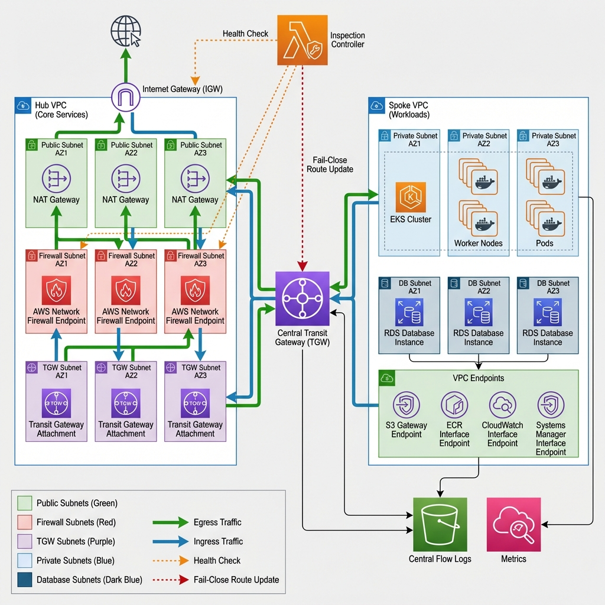

🏦 Enterprise AWS Networking Architecture

Centralized Egress, Zero-Trust Workload VPCs, and Mandatory Inspection

⸻

1. Architecture Overview

This network design implements a hub-and-spoke, zero-trust AWS networking model suitable for regulated environments such as banking, fintech, and SaaS platforms handling sensitive data.

Core Design Principles
• No direct internet access from workloads
• Mandatory, centralized egress inspection
• Fail-close security posture
• Least-privilege network access
• Private-by-default service consumption
• Auditability and forensic readiness

⸻

2. High-Level Architecture

                    ┌────────────────────────┐
                    │        Internet        │
                    └──────────┬─────────────┘
                               │
                         NAT Gateways
                               │
                    ┌──────────▼─────────────┐
                    │   Network Firewall     │
                    │ (Strict Allowlist)     │
                    └──────────┬─────────────┘
                               │
                    ┌──────────▼─────────────┐
                    │     Egress VPC          │
                    │ (Inspection + NAT)     │
                    └──────────┬─────────────┘
                               │
                    ┌──────────▼─────────────┐
                    │   Transit Gateway      │
                    │ (Inspection Routing)   │
                    └──────────┬─────────────┘
                               │
                    ┌──────────▼─────────────┐
                    │   Workload VPC          │
                    │ (EKS, RDS, Services)   │
                    └────────────────────────┘

⸻

3. Workload VPC (Spoke)

Purpose

The Workload VPC hosts application workloads (EKS, databases, internal services) and is intentionally isolated from the internet.

Key Decisions

❌ No Internet Gateway

create_igw = false

Why
• Prevents any accidental public exposure
• Eliminates direct egress paths
• Forces all outbound traffic through inspection

Trade-off
• Requires additional infrastructure (TGW + Egress VPC)

⸻

❌ No NAT Gateway

enable_nat_gateway = false

Why
• NAT inside workload VPCs is a common bypass vector
• Centralizing NAT ensures uniform security controls

Trade-off
• Higher latency compared to local NAT
• Acceptable in exchange for security guarantees

⸻

✅ Private Subnets Only

private_subnets = [...]

Why
• Enforces zero-trust networking
• Aligns with regulatory expectations (PCI, SOC2, ISO)

⸻

4. Private Service Access (VPC Endpoints)

Interface Endpoints (AWS Services)

Services such as:
• ECR
• STS
• Logs
• SSM
• EKS
• ELB / Auto Scaling
• SNS / SQS

are accessed without touching the public internet.

vpc_endpoint_type = "Interface"
private_dns_enabled = true

Why
• Prevents data exfiltration via public endpoints
• Reduces attack surface
• Improves reliability

Trade-off
• Higher cost per endpoint
• Additional operational complexity

⸻

Secrets Manager & KMS (Strict Policies)

Endpoints enforce deny-by-default with explicit IRSA role allow-listing.

Why
• IAM alone does not protect against network-level abuse
• VPC Endpoint policies add a second enforcement layer

Security Benefit
• Even compromised workloads cannot access secrets unless identity AND network policy match

⸻

S3 Gateway Endpoint

vpc_endpoint_type = "Gateway"

Why
• Gateway endpoints are cheaper and scale better for S3
• Used with restrictive bucket policies

Trade-off
• Less granular than interface endpoints
• Acceptable for S3’s access model

⸻

5. Egress VPC (Hub)

Purpose

The Egress VPC is the only place in the environment allowed to:
• Access the internet
• Perform NAT
• Perform deep packet inspection

⸻

NAT Gateways (Per AZ)

one_nat_gateway_per_az = true

Why
• Prevents cross-AZ traffic charges
• Ensures AZ fault isolation

Trade-off
• Higher cost than single NAT
• Required for enterprise availability

⸻

Network Firewall

Stateful Allowlist Model

generated_rules_type = "ALLOWLIST"
stateful_default_actions = ["aws:drop_strict"]

Why
• Zero-trust egress
• Only explicitly approved domains are reachable
• Prevents malware C2, data exfiltration, and supply-chain attacks

Trade-off
• Requires maintenance of allowlist
• Intentional operational friction for security

⸻

6. Transit Gateway (Central Control Plane)

Why Transit Gateway?
• Scales better than VPC peering
• Enforces centralized routing policy
• Required for inspection architectures

⸻

Appliance Mode Enabled

appliance_mode_support = "enable"

Why
• Preserves symmetric routing
• Required for stateful firewalls

Without this
• Return traffic bypasses firewall
• Connections break unpredictably

⸻

Inspection Route Table

All traffic from workload VPCs is routed as:

Workload → TGW → Egress VPC → Firewall → NAT

There is no alternate path.

⸻

7. Mandatory Firewall Traversal

aws_route (intra_subnet) → vpc_endpoint_id (firewall)

Why this matters
• TGW alone does not enforce firewall usage
• Explicit routing to firewall endpoints prevents bypass

This is a critical enterprise-grade control.

⸻

8. Fail-Close Design Philosophy

Problem

What happens if the firewall becomes unhealthy?

Solution
• Lambda continuously monitors firewall health
• TGW routes are dynamically switched to:
• Blackhole (fail-close)
• OR restored to egress attachment

Why
• Fail-open is unacceptable in regulated environments
• Outage > data breach

⸻

9. Observability & Audit Readiness

VPC Flow Logs

Enabled on:
• Workload VPC
• Egress VPC

Why
• Required for forensic analysis
• Feeds Security Lake / OpenSearch / Athena

⸻

EventBridge + Lambda
• Firewall health monitoring
• Automated remediation

⸻

10. Security Trade-offs Summary

Decision Advantage Trade-off
No NAT in workloads Zero bypass risk Higher latency
Central egress Uniform control Added complexity
Strict firewall allowlist Strong security Maintenance overhead
Interface endpoints No internet exposure Cost
Fail-close routing Compliance-grade Possible outages

⸻

11. When to Use This Architecture

✔ Banks
✔ Fintech
✔ Regulated SaaS
✔ Multi-tenant platforms
✔ Zero-trust environments

❌ Early-stage startups
❌ Cost-optimized dev environments

⸻

“I designed the network assuming compromise is inevitable.
The goal is to ensure no workload can ever exfiltrate data or access secrets without explicit identity, network, and inspection approval — and that failure always defaults to secure.”
